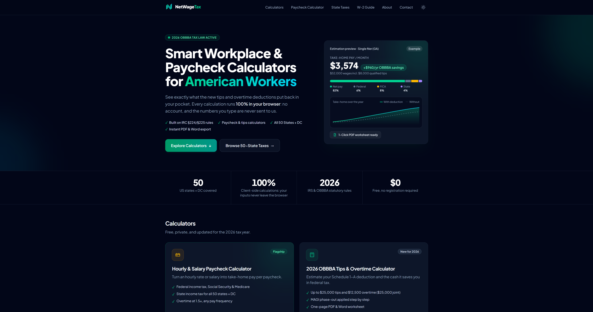

# NetWageTax

Calculadoras fiscales y de nómina para trabajadores de EE. UU., centradas en la deducción de propinas y horas extra de la ley OBBBA (2025–2028).

**Web en producción:** [netwagetax.com](https://netwagetax.com)



## Funcionalidades

- **Calculadora de la deducción OBBBA** ("No Tax on Tips / No Tax on Overtime"): aplica los topes por estado civil, la reducción progresiva según ingresos (MAGI) en tramos de $1.000 y los casos no elegibles. Estima el ahorro en el impuesto federal y muestra el desglose del sueldo neto.
- **Decodificador del W-2 (Casilla 12)**: explica los nuevos códigos TA, TP y TT y rellena la calculadora con el importe introducido.
- **Calculadora de nómina**: sueldo por horas o anual, horas extra y frecuencia de pago. Calcula el impuesto federal, FICA (Social Security, Medicare y Additional Medicare) y una estimación del impuesto estatal.
- **Explorador de impuestos estatales**: mapa interactivo de los 50 estados + DC y una página estática por estado, con tipos, estados vecinos y enlaces a las fuentes oficiales.
- **Exportación del resultado** a Word, Excel y PDF (desde el diálogo de impresión del navegador).
- **Sin backend**: todos los cálculos y los archivos exportados se generan en el navegador; ningún dato introducido sale del dispositivo.

## Tecnologías

- [Astro](https://astro.build) 7: generación estática de páginas e islas interactivas
- React 19 y TypeScript
- Tailwind CSS 4
- Vitest para los tests de la lógica de cálculo
- `docx` y SheetJS (`xlsx`) para exportar a Word y Excel
- `d3-geo` y `us-atlas` para generar el mapa SVG de los estados
- Desplegado en Vercel

## Ejecutarlo en local

Requiere Node.js 22.12 o superior.

```sh
git clone https://github.com/jesus-dev39/obbba-tax-calculator.git
cd obbba-tax-calculator
npm install
npm run dev        # servidor de desarrollo en http://localhost:4321
```

| Comando | Descripción |
| :-- | :-- |
| `npm run dev` | Servidor de desarrollo |
| `npm test` | Ejecuta los tests con Vitest |
| `npm run build` | Genera la web estática en `dist/` |
| `npm run preview` | Sirve la build de producción en local |
| `npm run generate:map` | Regenera los trazados SVG del mapa de estados |

**Variables de entorno:** la web no necesita ninguna. `.env.example` solo documenta `CHROME_PATH`, que es opcional y la usa `scripts/export-logo.mjs` para exportar el logo a PNG.

## Estructura del proyecto

```text
src/
├── lib/          # Lógica de cálculo en funciones puras (OBBBA, nómina, FICA, estados) y sus tests
├── components/   # Islas de React: calculadoras, decodificador W-2, mapa, exportación
├── pages/        # Rutas de Astro: herramientas, guía, página por estado y páginas legales
└── layouts/      # Layout base con SEO y metadatos
scripts/          # Generación del mapa SVG y exportación del logo
SPEC.md           # Especificación inicial: reglas fiscales, inputs/outputs y casos de prueba
```

## Retos y aprendizajes

**Cálculos fiscales correctos.** El mayor reto fue implementar bien las reglas fiscales: los datos de cada estado, los límites de 2026 de la deducción de propinas y horas extra y la reducción progresiva según ingresos. Aislé la lógica en funciones puras en `src/lib/`, con los parámetros de cada año en una tabla en lugar de números sueltos por el código, y contrasté los resultados con ejemplos de la documentación del IRS. Los casos de prueba definidos en la especificación, incluidos los límites de cada tramo, están cubiertos con tests en Vitest.

**Privacidad.** Quería que ningún dato saliera del navegador, así que todos los cálculos y la exportación a PDF, Word y Excel se hacen en el cliente, sin backend.

**SEO y AdSense.** Para posicionar la web generé con Astro una página estática por estado. Para que AdSense aprobara el sitio añadí la política de privacidad, los términos de uso, un aviso legal y suficiente contenido original.

**Qué aprendí.** A lanzar un producto completo: comprar y configurar un dominio, SEO técnico, generar páginas estáticas con Astro y trabajar con TypeScript en una lógica de negocio compleja en la que cualquier error se nota en el resultado.

**Uso de IA.** Desarrollé el proyecto con apoyo de asistentes de IA para escribir código. Yo definí la especificación (`SPEC.md`) con las reglas fiscales y los casos de prueba, verifiqué las cifras con las fuentes oficiales, tomé las decisiones de producto y de arquitectura y revisé el código antes de integrarlo.

## Autor

**Jesús Ruiz Plana**
[LinkedIn](https://www.linkedin.com/in/jesusruizplana/) · [GitHub](https://github.com/jesus-dev39)

---

*Las calculadoras ofrecen estimaciones con fines educativos y no constituyen asesoramiento fiscal.*
